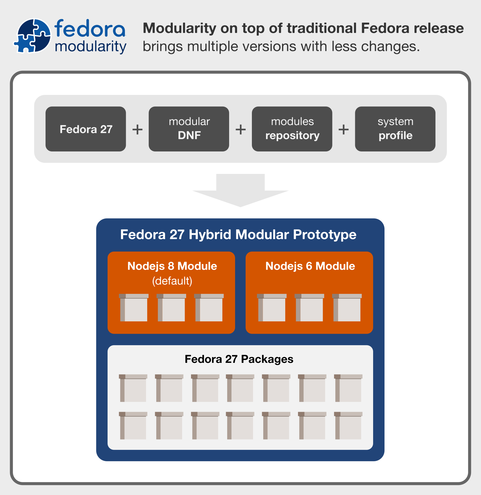
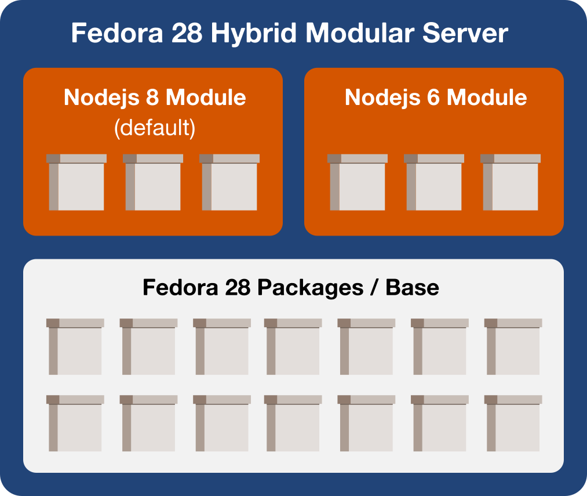
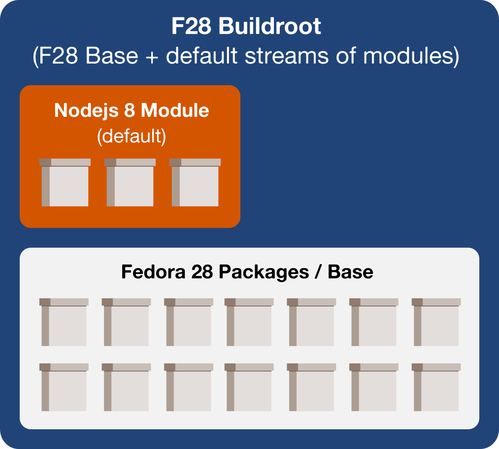
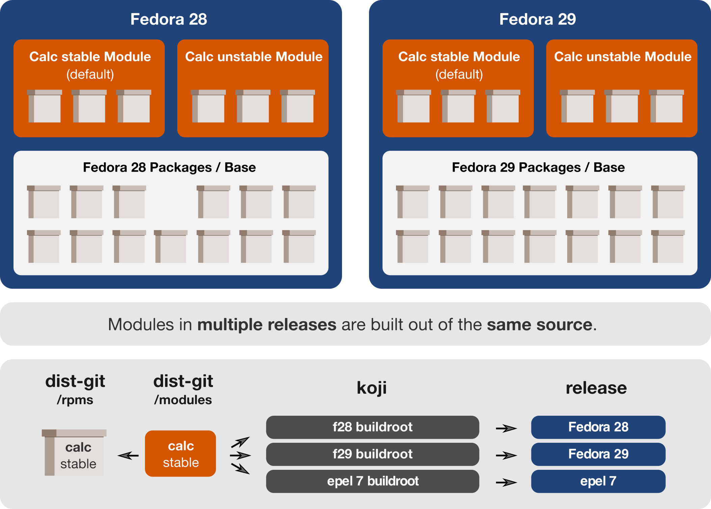

# Fedora 27 - Hybrid Modular Demo and Proposal



A demo of using [Modularity](https://docs.pagure.org/modularity) on top of a traditional Fedora release.

## Interactive demo

```
$ docker run --rm -it asamalik/modularity-hybrid-demo
```

Fedora 27 includes Node.js 8, which is the current version of the platform. Running the usual installation command installs this version the same way as in traditional Release:

```
$ dnf install nodejs
...
$ node --version
v8.9.1
```

As we can see, there is no difference in the default behavior between the traditional release and this hybrid modular one. But what if I want Node.js 6 I used in Fedora 26? I can do that using the new modular syntax:

```
$ dnf install @nodejs:6
...
$ node --version
v6.12.0
```

Great! Now I have installed Node.js 6 while Node.js 8 is also available. But wait, what if I try to update the system? Will it stay at version 6?

```
$ dnf update nodejs
...
Nothing to do.
Complete!
```

Wow! It really works! Let's prove that the version 8 is still available.

```
$ dnf module list
...
Name                     Stream     ...
nodejs                   6          ...
nodejs                   8          ...
```

Excellent! Can I go back to Node.js 8?

```
$ dnf install @nodejs:8
...
$ node --version
v8.9.1
```

Woot!

## Implementation in Fedora 28

These are thoughts how we could implement it in Fedora 28.

### The end result



**Two repositories**

1. Fedora 28 Everything (Base) - all traditional RPM packages
2. Fedora 28 Modular Updates (Modules) - all modules, through Bodhi

We would also need to get the modular DNF into F28 mainline.

### Building



Modules and RPM packages should be built aganst the same buildroot - the Fedora 28 Buildroot.

RPM packages in the Base would be built the same way as they are now, with no changes.

Modules would be built using MBS agains a "buildroot" module that would be created in a simmilar way to the existing "bootstrap" module. It would contain all packages from the Base and default streams of modules.

Modules would be significantly smaller than they were in the original approach, containing only the packages of a given application or stack.

Packages in the default modules would need to have at least the same EOL and at least the same ABI stability guarantees as other packages in the release.

### New terminology

**To modularize something** would mean taking these steps:

1. Make and build a module out of existing packages in Base
2. Register its stream as a default for the release (explained below)
3. Send an update through Bodhi

Modularizing a new version would skip the "register a default" step.

**To register a default** would mean:

1. Tagging the module stream into the F28 buildroot
2. Adding the module stream into the F28 system profile

### Dealing with runtime dependencie

Modules would not need specify any runtime modular dependencies in order to use packages from the Base. Modules can have a  modular dependencies specified in case a non-default stream is needed.

## New features in Fedora 29

Fedora 29 would be a second modular release. Using the same source to build modules for both (F28 and F29) release would be quite useful. A new discussed feature called **stream expansion** would allow us to do exactly that.



Defining a modulemd would be in fact a "configuration" in the beginning in order to build the same source for multiple releases. And thanks to **Freshmaker**, packager would only need to push to a single branch to update their package in all releases. The builds would happen automatically.

## Credits

I wrote this based on discussion of many people in the [#fedora-modularity](irc://freenode/fedora-modularity) irc channel.

Another examples created (hours) before this one:

1. First was [dockerhub/jamesantill/f27-mods](https://hub.docker.com/r/jamesantill/f27-mods/) container image by James Antill that added all Fedora 27 Server Beta modules on top of traditional F27 release. DNF in this example is extremely slow as the current implementation can't deal with so many modules.
2. Second was [github/sgallagher/semimodular_poc](https://github.com/sgallagher/semimodular_poc) Ansible playbook by Stephen Gallagher that adds two modules (Node.js 6 and Node.js 8) on top of any Fedora 27 system. You need to have a running system somewhere to try this.
3. Third was [dockerhub/langdon/semimodular-poc](https://hub.docker.com/r/langdon/semimodular-poc/) container image by Langdon White which is a result of running the previously mentioned Ansible playbook against an F27 container image. This image is relatively large in size as it bundles the two Node.js modules.

This repository presents a minimalist working example based on all of the above.

It is not a done thing, much better followup created by the group is coming out soon. Thanks all for ideas and discussions!


