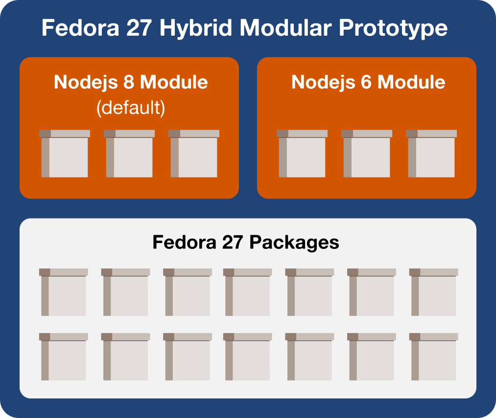

# Fedora 27 - Hybrid Modular Demo


A demo of using [Modularity](https://docs.pagure.org/modularity) on top of a traditional Fedora release.

## Try it



```
$ docker run --rm -it asamalik/modularity-hybrid-demo
```


